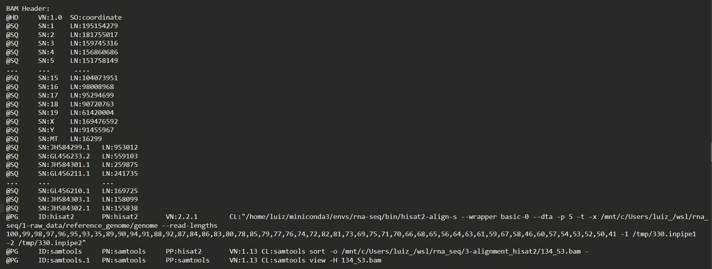

# Samtools

Samtools é um conjunto de utilitários de manipulação como visualização e edição de dados de alinhamentos nos formatos 
SAM (Sequence Alignment / Map), BAM (formato binário de SAM) e CRAM. 

Samtools realiza converção entre os formatos, faz ordenação, mescla, indexa e pode localizar reads em qualquer região rapidamente.

Samtools é projetado para funcionar em fluxo. Ele considera um arquivo de entrada como a entrada padrão (stdin) e um arquivo de 
saída como a saída padrão (stdout). Vários comandos podem ser combinados em pipes.

Samtools sempre envia mensagens de aviso e erro para a saída de erro padrão (stderr).

[link](http://samtools.sourceforge.net/samtools.shtml#5)

### Install samtools
```bash
# -- version 1.9 and 1.13 are stable and working with python 3.8

# Este comando instalará a versão mais recente ou a principal
conda install samtools   

# Se encontrado algum problema, reinstale uma versão inferior estável: testada 23/12/2021
conda install -c bioconda samtools=1.9 --force-reinstall
```


## Arquivos BAM contêm uma seção de cabeçalho e uma seção de alinhamento:

	▶	Cabeçalho — Contém informações sobre o arquivo inteiro, como nome da amostra, comprimento da amostra e método de alinhamento. 
	Os alinhamentos na seção de alinhamentos estão associados a informações específicas na seção de cabeçalho.

	▶	Alinhamento — Contém nome de read, sequência de read, qualidade da read, informações de alinhamento e tags personalizadas. 
	O nome inclui o cromossomo, a coordenada inicial, a qualidade do alinhamento e a string do descritor de correspondência.

A seção de alinhamentos inclui as seguintes informações para cada par de leitura:

	▶ RG: Grupo das reads, que indica o número de leituras para uma amostra específica.
	▶ BC: Tag de código de barras, que indica o ID da amostra demultiplexada associada à read.
	▶ SM: Qualidade de alinhamento de extremidade única.
	▶ AS: Qualidade de alinhamento em pares.
	▶ NM: Editar tag de distância editada, que registra a distância Levenshtein entre a read e a referência.
	▶ XN: tag de nome do Amplicon, que registra o ID do bloco do amplicon associado à read.

Arquivos BAM indexados (.bai) comtém um índece que corresponde ao arquivo .BAM

### Samtools view

Para converter SAM em BAM, usamos o comando samtools view. Devemos especificar que nossa entrada está no formato SAM (por padrão, espera BAM)
usando a opção -S. Devemos também dizer que queremos que a saída seja BAM (por padrão, ela produz BAM) com a opção -b. O Samtools segue a convenção
do UNIX de enviar sua saída para o STDOUT do UNIX, portanto, precisamos usar um operador de redirecionamento (“>”) para criar um arquivo BAM a partir da saída.

#### Sintax:
	samtools view [options] [in.bam or in.sam or in.cram] [region ...]

#### Visualização
```bash
samtools view -S -b sample.sam > sample.bam

# Agora, podemos usar o comando samtools view visualizar.
samtools view sample.bam | head

# Por padrão o samtools ignora o cabeçalho. Para visualização do header, use a opção -H
samtools view -h sample.bam | less

# Visualizar apenas o cabeçalho
samtools view -H sample.bam | less
```

#### Uso da opção region

Para o uso desta opção, o arquivo bam precisa ter o index criado pela função index do samtools
```bash
# Esta função gera um arquivo .bai
samtools index sample.bam

# Agora sim é possível visualizar uma região do arquivo bam
samtools view sample.bam "chr22:24000000-25000000"

# Visualizar uma região do arquivo bam, tendo como referencia um arquivo .bed com as coordenadas.
# este arquivo bed, pode ser um arquivo com pelo menos 3 colunas. ex: chr22	24000000 25000000
samtools view -L sample.bed sample.bam

```

### Samtools faidx
```bash
# Este commando gera um index .fai de um arquivo fasta
samtools faidx ref_genome/genome.fa

# Extrai sequenncias de um arquivos fasta, e retorna apenas aquelas da qual a id esta presente num arquivo contendo uma lista de ids das sequencias desejadas.
# O único problena com esta função é que, a id presente no novo arquivo será a id da lista e não a id do arquivo fasta original.
# caso se deseje manter todas as informações da sequencia do arquivo original, melhor usar a função seqkit grep
xargs samtools faidx data/sequences.fasta < retrons_ids2.txt > retrons_seqs.txt
```

### Samtools sort

Quando os arquivos FASTQ são alinhados com uma sequência de referência, os alinhamentos produzidos estão em ordem aleatória com relação
à sua posição no genoma de referência. Em outras palavras, o arquivo BAM está na ordem em que as sequências ocorreram nos arquivos FASTQ de entrada.

Muitas análises down stream requerem que o arquivo BAM seja ordenado de forma que os alinhamentos ocorram na “ordem do genoma”. Ou seja, 
ordenados posicionalmente com base em suas coordenadas de alinhamento em cada cromossomo.

Ordenando o arquivo bam
```bash
samtools sort sample.bam -o sample.sorted.bam

# Visualizando o bam ordenado
samtools view sample.sorted.bam | head
```

Convertendo sam para um bam ordenado
```bash
samtools view -bS sample.sam | samtools sort -o sample.sorted.bam

# Reque versões mais recentes do samtools. 1.2 ou mais recente
samtools sort -o sample.bam sample.sam
```

## Controle de qualidade do arquivo de alinhamento binário BAM.

### quickcheck

Verifique rapidamente se os arquivos de entrada estão intactos. O comando verifica se o início do arquivo contém um cabeçalho válido (todos os formatos) 
contendo pelo menos uma sequência de destino e, em seguida, busca o final do arquivo e verifica se um final de arquivo (EOF) está presente e intacto (apenas BAM e CRAM )  
samtools quickcheck [options] in.sam|in.bam|in.cram [ ... ]

```bash
# Se o arquivo estiver ok, não haverá nenhum output
samtools quickcheck -v sample.bam
```

### Conferindo o resultado do sort:

```bash
# Visualizando o cabeçalho do alinhamento
samtools view -H sample.bam | less 
```

Se o arquivo estiver ordenado na sequencia genômica, um output similar ao descrito abaixo será mostrado.


SO: indica que o arquivo está ordenado por coordenadas(SO = Sort Order).

### samtools stats
Produzindo um resumo estatístico do alinhamento
```bash
samtools flagstat sample.sorted.bam

# Dentro do diretório com os arquivos BAM.
# O comando abaixo, realiza o flagstat que cada arquivo BAM e adiciona o resultado a um arquivo txt.
sample="sample1.bam sample2.bam sample3.bam"; for i in $sample; do samtools flagstat $i | tee -a flagstat.txt; done

# Segunda opção, se o diretório conter apenas os arquivos bam, dos quais se dejejar realizar o flagstat
for i in $(ls); do samtools flagstat $i | tee -a flagstat.txt; done
```


# Variant call with Samtools

## samtools markdup

Este programa conta com as tags MC e ms que o fixmate fornece.
Para isso marcaremos os alinhamentos duplicados em um arquivo ordenado por coordenadas que foi executado através do samtools fixmate com a opção -m.

#### Options:
	-s -------------------> Imprime algumas estatísticas básicas.
	-f arquivo -----------> Grava as estatísticas no arquivo nomeado.
	-u -------------------> Saída sem compressão SAM, BAM ou CRAM.
	-O, --output-fmt -----> Especifica o formato de saída (SAM, BAM, CRAM)
	
	-m, --mode TYPE ------> Método de decisão duplicado para leituras emparelhadas. Os valores são t ou s.
	O modo t mede as posições com base no início/fim do modelo (padrão).
	O modo s mede as posições com base no início da sequência.
	Enquanto os dois métodos identificam principalmente as mesmas leituras como duplicatas, o modo s tende a retornar mais resultados. 
	As leituras não pareadas são tratadas de forma idêntica por ambos os modos.


### Executando a séria de comando samtools
```bash
# Este comando irá, ordenar o arquivo bam por nomes.
samtools sort -n -o Sorted_names.bam -O BAM Alignment.bam
samtools sort -n -o Sorted_names.bam Alignment.bam

# Este irá preencher as coordenadas do 'mate pair read' e inserir os campos de tamanho
samtools fixmate -m Sorted_names.bam Fixmate.bam

# Este ordenará o arquivo baseado nas coordenadas dos cromossomos
samtools sort -o Sorted.bam Fixmate.bam

# Este irá remover as duplicatas e imprimir informações estatística da operação. 
samtools markdup -r -s Sorted.bam Final_File.bam
```

### Pipe dos comandos fixmate, sort, markdup
```bash
samtools fixmate -m alignment.bam - | samtools sort -o - | samtools markdup -r -s - mapped/out_sorted_Markdup.bam
```

### Pipe dos últimos comando como o alinhamento
```bash
alignment (options...) | samtools fixmate -m - - | samtools sort -o - | samtools markdup -r -s - mapped/out_sorted_Markdup.bam

alignment (options...) | samtools sort -n - | samtools fixmate -m - - | samtools sort -o - | samtools markdup -r -s - mapped/out_sorted_Markdup.bam

```


### Samtools mpileup options

	-B, –no-BAQ ------------> Probabilidade em escala Phred de uma base lida estar desalinhada. A aplicação desta opção ajuda muito a reduzir SNPs falsos.
	-u, –uncompressed ------> Gera um arquivo de saída VCF/BCF não compactada, que é preferida em pipelines.
	-g, –BCF ---------------> Calcula as probabilidades do genótipo.
	-f, –fasta-ref file ----> O arquivo de referência indexado por faidx no formato FASTA. O arquivo pode ser compactado opcionalmente por bgzip.
	-o ---output FILE ------> Defini o arquivo de saída


### Produzindo "genotype likelihoods" no formato VCF ou BCF
```bash
samtools mpileup -vg -f ref.fa in.bam

# Equivalente em bcftools 
bcftools mpileup -f ref.fa in.bam
```
O comando mpileup foi transferido para bcftools para evitar erros resultantes do uso de versões incompatíveis de samtools e bcftools 
ao usar no pipeline de chamada mpileup + bcftools.


### samtools mpileup
```bash
# Produzindo um arquivo the variant call no formato binário não comprimido.
samtools mpileup -ugf reference.fasta sample.sorted.bam -o file.bcf

# Desabilite o realinhamento probabilístico para o cálculo da qualidade do alinhamento de base (BAQ)
samtools mpileup -B -ugf reference.fasta sample.sorted.bam -o file.bcf

# Crie um arquivo vcf, que contenha apenas as variações
samtools mpileup -B -ugf reference.fasta sample.sorted.bam | bcftools call -vmO z - > filename.vcf.gz
```
As variantes genéticas detectadas serão armazenadas no arquivo vcf.


## Visualização das Variantes

### samtools tview
```bash
samtools tview wu_0.bt2.sorted.bam ref_genome/wu_0.v7.fas
```


### IGV
Para poder visualizar as variantes nos arquivos vcf, você pode usar o programa IGV, que aceita vários formatos de arquivos de entrada
por exemplo. fasta, bam, vcf e gff. Depois de carregar seu(s) arquivo(s) bam e o(s) arquivo(s) vcf correspondente(s).


## Referências:

http://www.htslib.org/doc/#manual-pages  
http://www.htslib.org/doc/samtools.html  
http://www.htslib.org/doc/samtools-markdup.html  
http://www.htslib.org/doc/samtools-mpileup.html  